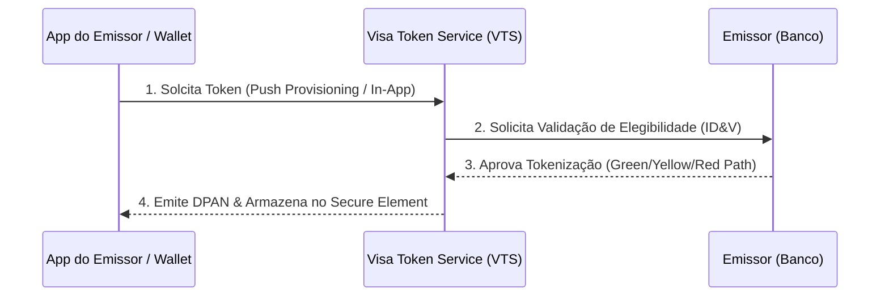

# Visa Token Service (VTS) — Arquitetura de Referência

## 🛡️ O que é o VTS?
O **Visa Token Service (VTS)** é a tecnologia de segurança global da Visa que substitui números de cartão de 16 dígitos (PAN - Primary Account Number) por tokens numéricos exclusivos (**DPAN** ou **Token de E-commerce**).

---

## 🔄 Fluxo de Tokenização

---

## 📊 Vantagens Principais
- **Redução de Fraude**: Tokens roubados em vazamentos não funcionam fora do dispositivo/carteira específica.
- **Atualização Automática (ABO - Account Updater)**: Se o cartão físico expirar ou for reemitido, o token continua funcionando sem o cliente ter que recadastrar.
